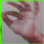
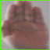

# Real Time Hand Gesture Recognition and Tracking

### Human Computer Interaction (HCI)

Real time robust hand gestures recognition and tracking on a live stream . This forms the basis for HCI (Human Computer Interaction). Users can interact with the computer (e.g. control vlc media player or control mouse pointer  here) via webcam using dynamic hand gestures accomplished using computer vision (CNN’s)

### Pipeline:

1. Hand detection -> Transeferable model of ssd-mobilenet-v1-coco is trained for detecting hands. It takes images as input and outputs bounding box of detected hands. Dataset used : http://vision.soic.indiana.edu/projects/egohands/.

2. Static Hand Gesture Recognition: Grayscale cropped images of detected hands are passed through a CNN which classifies the gesture in static frames.
Required Dataset is generated using Hand detection model used in step one.

3. Hand tracking: Centroid tracking algorithm is used for tracking of detected hand.

### File Description:

1. train_detector_hand.ipynb -> training ssd-mobilenet (pre-trained) using transfer learning to detect hands (took approximately 50-60k iterations to reach total loss below 2.4).

2. hand_inference_graph2 -> saved tensorflow graph for ssd-mobilenet trained in above notebook.

3. addpose.py -> script used for creating dataset (live) for classification of custom gestures. Hands are detected from each frame webcam live stream (using above trained detector) are cropped to (64x64) and saved to a directory (./Gestures/New by default).

          + garbage
 

4. recognition2.ipynb -> training the custom cnn for classification of static gestures. It took about 10 iterations to reach val_accuracy of 99.99%. 

   Cnn architecture : 

        InputLayer => Conv2D => Batch-Normalization => Conv2D => Batch-Normalization => MaxPooling2D => Dropout => Flatten => F.C => Dropout => F.C.

    
5. ## app.py 
    Main script which combines and facilitates all the functionalites of app. app.py.  Multi-threading is used to increase the fps.     More : https://www.pyimagesearch.com/2015/12/21/increasing-webcam-fps-with-python-and-opencv/

6. utils contains some utility functions to run detections and classification.

7. detect.py -> Single Threaded script to run detection and static gesture classification. (Not used in project)

 

### Controlling vlc media player (Results) :

   On detecting dynamic gestures signals are sent to perform required particular actions using pyautogui.

    <a href="https://youtu.be/C-kbLRoDPWQ"> HCI part1 </a>
    
    <a href="https://www.youtube.com/watch?v=Prmh1Tl5ngM"> HCI part2 </a>
    
    

 

------------------------------------------------------------------------------------

Reference: https://github.com/victordibia/handtracking
